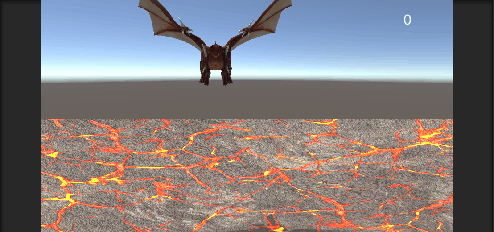
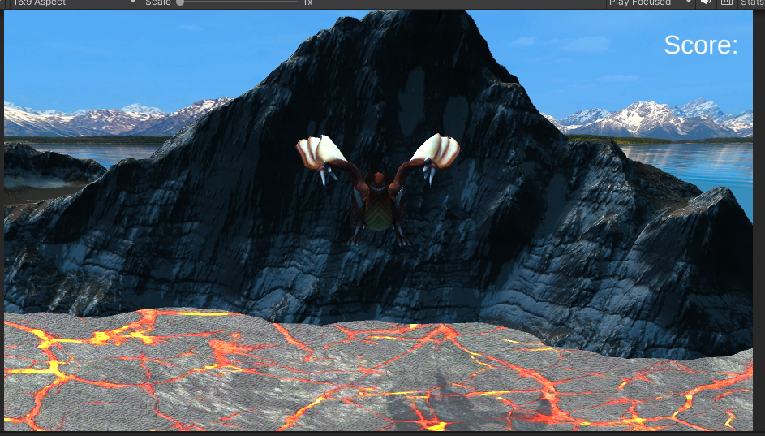
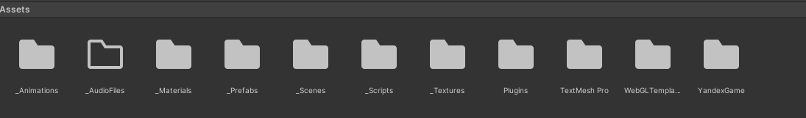

# РАЗРАБОТКА ИГРОВЫХ СЕРВИСОВ
Отчет по лабораторной работе #3 выполнил:
- Назаров Лев Сергеевич
- РИ300012

Отметка о выполнении заданий (заполняется студентом):

| Задание | Выполнение | Баллы |
| ------ | ------ | ------ |
| Задание 1 | * | 60 |
| Задание 2 | * | 20 |
| Задание 3 | * | 20 |

знак "*" - задание выполнено; знак "#" - задание не выполнено;

Работу проверили:
- к.т.н., доцент Денисов Д.В.
- к.э.н., доцент Панов М.А.
- ст. преп., Фадеев В.О.

## Цель работы
Интеграция интерфейса пользователя в разрабатываемое интерактивное приложение.

## Задание 1
### Используя видео-материалы практических работ 1-5 повторить реализацию игровых механик.
Ход работы:
#### Работа 1: «Реализация механизма ловли объектов»
1) Добавить движение энерго щита за мышкой:
```cs
void Update()
{
    var mousePos2D = Input.mousePosition;
    mousePos2D.z = -Camera.main.transform.position.z;
    var mousePos3D = Camera.main.ScreenToWorldPoint(mousePos2D);
    var pos = transform.position;
    pos.x = mousePos3D.x;
    transform.position = pos;
}
```
2) Добавить уничтожение яиц при столкновении с щитом:
```cs
private void OnCollisionEnter(Collision collision)
{
    var collided = collision.gameObject;
    if (collided.tag == "Dragon Egg")
    {
        Destroy(collided);
    }   
}
```
3) Добавить на HUD текст для отслеживания счета.

#### Работа 2: «Реализация графического интерфейса с добавлением счетчика очков»
1) Добавить отслеживание счета:
```cs
public TextMeshProUGUI scoreGT;
private int score;

private void OnCollisionEnter(Collision collision)
{
    var collided = collision.gameObject;
    if (collided.tag == "Dragon Egg")
    {
        Destroy(collided);
        score++;
        scoreGT.text = score.ToString();
    }
}
```
2) Добавить уничтожение яиц при пропуске одного яица:
```cs
public void DragonEggDestroyed()
{
    var tDragonEggArray = GameObject.FindGameObjectsWithTag("Dragon Egg");
    foreach (var egg in tDragonEggArray)
    {
        Destroy(egg);
    }
}
```
## Задание 2
Ход работы:
#### Работа 3: «Уменьшение жизни. Добавление текстур»
1) Добавить уничтожение слоев щита при пропуске яиц:
```cs
public void DragonEggDestroyed()
{
    var tDragonEggArray = GameObject.FindGameObjectsWithTag("Dragon Egg");
    foreach (var egg in tDragonEggArray)
    {
        Destroy(egg);
    }
    var shield = shieldList.Last();
    shieldList.Remove(shield);
    Destroy(shield);
}
```
2) Добавить перезапуск сцены при отсутствии щитов:
```cs
public void DragonEggDestroyed()
{
    var tDragonEggArray = GameObject.FindGameObjectsWithTag("Dragon Egg");
    foreach (var egg in tDragonEggArray)
    {
        Destroy(egg);
    }
    var shield = shieldList.Last();
    shieldList.Remove(shield);
    Destroy(shield);
    if (shieldList.Count == 0)
    {
        SceneManager.LoadScene("_0Scene");
    }
}
```

3) Добавить на фон гору из ассет пака Autumn Mountain.<br>
4) Добавить скайбокс из того же ассет пака:

#### Работа 4: «Структурирование исходных файлов в папке»
1) Создать папки для разных типов ассетов.
2) Перенести ассеты созданные за предыдущие работы в соответствующие папки.
3) Перенести ассеты из паков в соответствующие папки.

## Задание 3
Ход работы:
#### Работа 5: «Интеграция игровых сервисов в готовое приложение»
1) Настроить проект под WebGL и добавить в него плагин YandexGame.<br>
2) Забилдить проект и залить на яндекс игры. <br>
https://yandex.ru/games/app/198387?draft=true&lang=ru
## Выводы
Научился интегрировать яндекс игры в Unity проект и менять скайбокс в сцене.
## Powered by

**BigDigital Team: Denisov | Fadeev | Panov**